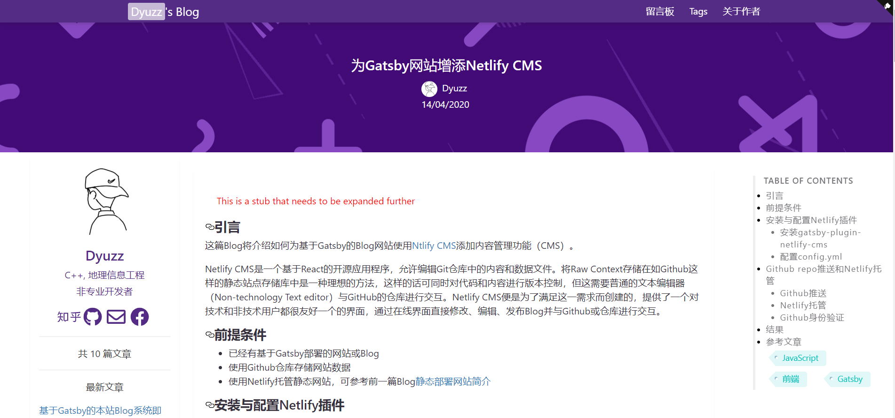
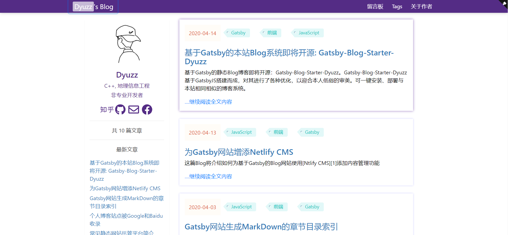

## [Gatsby-Blog-Starter-Dyuzz](https://www.dyuzz.club) 

[](https://github.com/calpa/gatsby-starter-calpa-blog/blob/master/LICENSE)
[](https://github.com/dyuzz/Gatsby-Blog-Starter-Dyuzz/pulls)
[](https://app.netlify.com/sites/dyuzz/deploys)

[简体中文](README_ZH_CN.md) | [English](README.md)




Notice: This Gatsby starter is developed based on [Calpa's starter](https://github.com/calpa/gatsby-starter-calpa-blog/)

Build a blog system like [Dyuzz's Blog](https://www.dyuzz.club) in ease.

If you like this framework, please give me a star. If there are many stars, it will be a driving force for me to keep updating.

## Feature

1. GatsbyJS v2
2. Google Analytics
3. Web App Manifest
4. Netlify Support
5. Gitalk Comment
6. SiteMap
8. Netlify CMS Support
9. TOC（TableOfContexts）
10. Pagination
11. SEO
12. Phone borwser Support


## Prerequisites

1. Git
1. Nodejs
1. Gatsbyjs CLI

## How To Install

1. [ install gatsby cli](https://www.gatsbyjs.org/docs/)

```bash
npm install --global gatsby-cli
```
2. install this Starter  

Option 1：Create a new Gatsby project using Gatsby，**xxxxx** is the custom project name
```bash
gatsby new xxxxx https://github.com/Dyuzz/Gatsby-Blog-Starter-Dyuzz
```
Option 2：If option 1 fails, you can try to install using the following command. 

- Download the project from GitHub to local
```bash
git clone https://github.com/Dyuzz/Gatsby-Blog-Starter-Dyuzz.git
```
- Enter the directory and install the dependent JS module
```bash
cd Gatsby-Blog-Starter-Dyuzz
npm install
```
3. develop blog. After that, you can enter 127.0.0.1:8000 in chrome or Firefox to see the blog of opinion deployment
```bash
gatsby develop
```

## config

1. Edit the export object in data/config：
```js
{
  "url": "https://www.dyuzz.club",
  "meta": {
    "favicon": "/favicons/android-chrome-512x512.png",
    "keyword": "Dyuzz, blog, C++",
    "description": "Dyuzz 的开发随笔",
    "theme_color": "#384f7c",
    "google_site_verification": "W1hBc-xxxxxxxxxxxxxxx_-G3ZY78q6PVBI"
  },
  "name": "Dyuzz",
  "about": "/2020/03/28/about-Dyuzz/",
  "email": "706940134@qq.com",
  "stats": {
    "image": "/favicons/android-chrome-512x512.png",
    "title": "之前一个月",
    "description": "之前一个月"
  },
  "title": "Dyuzz 的开发随笔",
  "gitalk": {
    "repo": "GiTalkofBlog",
    "admin": ["Dyuzz"],
    "owner": "Dyuzz",
    "clientID": "b00xxxxxxxxx6cdx",
    "clientSecret": "30df6fxxxxxxxxxxxxxd",
    "pagerDirection": "first",
    "distractionFreeMode": true
  },
  "License": "by",
  "friends": [
    {
      "href": "http://adcfj.cn/",
      "title": "数字中国研究院"
    }
  ],
  "iconUrl": "/favicons/android-chrome-512x512.png",
  "wordings": ["C++, 地理信息工程", "非专业开发者"],
  "gaTrackId": "UA-84737574-3",
  "navbarList": [
    {
      "href": "/guestbook/",
      "title": "留言板"
    },
    {
      "href": "/tags/",
      "title": "Tags"
    },
    {
      "href": "/2020/03/28/about-Dyuzz/",
      "title": "关于作者"
    }
  ],
  "redirectors": [
    {
      "toPath": "/2020/03/28/about-Dyuzz/",
      "fromPath": "/about/"
    }
  ],
  "gaOptimizeId": "GTM-WHP7SC5",
  "carouselItems": [
    {
      "src": "/favicons/android-chrome-512x512.png",
      "target": "/stats/"
    }
  ],
  "zhihuUsername": "dyuzz",
  "githubUsername": "Dyuzz",
  "maxPostsInPage": 10,
  "facebook": "Dyuzz"
}

```
2. If you need to use Google Analytics, change the tracking ID in gatsby-config.js
：
```js
    {
      resolve: `gatsby-plugin-google-analytics`,
      options: {
        // replace "UA-XXXXXXXXX-X" with your own Tracking ID
        trackingId: "xxxxxxxxxx",
      },
    },  
```
## Acknowledgements

Thank to GatsbyJS and [Calpa](www.calpa.me) for this open-source codes.

## Conntext me

If you have any problems, please do not hesitate to contact me. [Dyuzz](https://www.dyuzz.club/) or 706940134@qq.com
