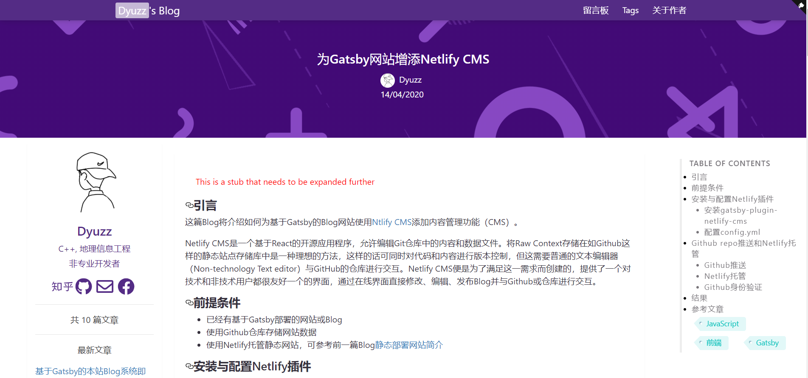

## [Gatsby-Blog-Starter-Dyuzz](https://www.dyuzz.club) 

[](https://github.com/calpa/gatsby-starter-calpa-blog/blob/master/LICENSE)
[](https://github.com/dyuzz/Gatsby-Blog-Starter-Dyuzz/pulls)
[](https://app.netlify.com/sites/dyuzz/deploys)

[简体中文](README_ZH_CN.md) | [English](README.md)

## 写在前面

最近一段时间由于新冠的原因，在家里有闲暇时间，且未来一段时间的学习中，可能需要使用Javascript，故打算基于Javascript搭建自己Blog站点，以学习和了解JS。经过一顿搜索后， 目前，应用最广的是[Hexo](https://hexo.io/)静态网站生成器，但是本人一贯原则是，在Optional下无论什么工具都用开源的和最新的，因此选中了基于React和GraphQL的GatsbyJS网站生成器。

由于我之前从事的C++桌面三维可视化应用的开发，并无任何前端开发经验，因此，以[calpa](https:www.calpa.me)的[gatsby-starter-calpa](https://github.com/calpa/gatsby-starter-calpa-blog)脚手架为基础，对其进行了约一个星期的小刀窄斧地改造，添加部分新功能，修改布局，以迎合本人低俗的审美，最终形成的Blog网站[见这里](https://www.dyuzz.club)

开源之道，有取有还，现将可以一键部署、启动的[Gatsby Blog Starter Dyuzz](https://github.com/Dyuzz/Gatsby-Blog-Starter-Dyuzz)博客框架开源，欢迎大家通过这个[Starter](https://github.com/Dyuzz/Gatsby-Blog-Starter-Dyuzz)搭建与[Dyuzz's Blog](https://www.dyuzz.club)相同或相似的Blog平台。

Github 地址：https://github.com/Dyuzz/Gatsby-Blog-Starter-Dyuzz  若喜欢此框架，请给个star，starer多的话将会是一种动力促使我持续更新。




## 功能特性

### 框架特性

1. 基于GatsbyJS v2
2. 支持Google Analytics
3. Web App Manifest
4. 可托管部署在Netlify（可参考前一篇Blog: [常见静态网站托管平台简介](https://www.dyuzz.club/2020/04/01/%E5%B8%B8%E8%A7%81%E9%9D%99%E6%80%81%E7%BD%91%E7%AB%99%E6%89%98%E7%AE%A1%E5%B9%B3%E5%8F%B0%E7%AE%80%E4%BB%8B)）
5. 评论区 (powered by Gitalk)
6. 高速解析 Markdown (有两个版本：Remarkable和MDX,目前开源版本为Remarkable)
7. 自动SiteMap,可在Google和Baidu搜索资源管理中提交站点地图链接
8. Netlify CMS支持，可通过在线CMS添加、编辑、发布Blog（可参考前一篇Blog: [为Gatsby网站增添Netlify CMS](https://www.dyuzz.club/2020/04/13/%E4%B8%BAGatsby%E7%BD%91%E7%AB%99%E5%A2%9E%E6%B7%BBNetlifyCMS)）
9. 右侧TOC（TableOfContexts）目录支持。

### UI特性

1. 响应式设计 适配手机浏览器、和PC浏览器。
1. 懒加载（图片） (基于[lozad.js](https://github.com/ApoorvSaxena/lozad.js))
1. 自动加载 Font Awesome (基于[react-fontawesome](https://github.com/FortAwesome/react-fontawesome))
1. 流畅滑动设计 (基于[smooth-scroll](https://github.com/cferdinandi/smooth-scroll))
1. pagination设计


## 使用该Blog的前提条件

1. Git
1. Nodejs
1. Gatsbyjs CLI

## 安装与配置

### 安装

1. [安装gatsby cli](https://www.gatsbyjs.org/docs/)

```bash
npm install --global gatsby-cli
```
2. 安装该Starter  

方法一：使用Gatsby创建新 Gatsby项目，**xxxxx**为自定义项目名称
```bash
gatsby new xxxxx https://github.com/Dyuzz/Gatsby-Blog-Starter-Dyuzz
```
方法二：若方法一安装失败，可以尝试使用以下命令安装。 

- 从github将本项目下载到本地
```bash
git clone https://github.com/Dyuzz/Gatsby-Blog-Starter-Dyuzz.git
```
- 进入改目录，并安装依赖的js模块，注意由于国内网速的原因可能会失败，多安装几次，或者挂代理。
```bash
cd Gatsby-Blog-Starter-Dyuzz
npm install
```
3. 建立blog,输入以下命令，之后在Chrome或者Firefox中输入127.0.0.1:8000，便可看到意见部署的Blog
```bash
gatsby develop
```

### 配置

1. 大部分需要修改的内容如网站标题、Gitalk api、图标等，在 data/template/config.json中更改：
```js
{
  "url": "https://www.dyuzz.club",
  "meta": {
    "favicon": "/favicons/android-chrome-512x512.png",
    "keyword": "Dyuzz, blog, C++",
    "description": "Dyuzz 的开发随笔",
    "theme_color": "#384f7c",
    "google_site_verification": "W1hBc-xxxxxxxxxxxxxxx_-G3ZY78q6PVBI"
  },
  "name": "Dyuzz",
  "about": "/2020/03/28/about-Dyuzz/",
  "email": "706940134@qq.com",
  "stats": {
    "image": "/favicons/android-chrome-512x512.png",
    "title": "之前一个月",
    "description": "之前一个月"
  },
  "title": "Dyuzz 的开发随笔",
  "gitalk": {
    "repo": "GiTalkofBlog",
    "admin": ["Dyuzz"],
    "owner": "Dyuzz",
    "clientID": "b00xxxxxxxxx6cdx",
    "clientSecret": "30df6fxxxxxxxxxxxxxd",
    "pagerDirection": "first",
    "distractionFreeMode": true
  },
  "License": "by",
  "friends": [
    {
      "href": "http://adcfj.cn/",
      "title": "数字中国研究院"
    }
  ],
  "iconUrl": "/favicons/android-chrome-512x512.png",
  "wordings": ["C++, 地理信息工程", "非专业开发者"],
  "gaTrackId": "UA-84737574-3",
  "navbarList": [
    {
      "href": "/guestbook/",
      "title": "留言板"
    },
    {
      "href": "/tags/",
      "title": "Tags"
    },
    {
      "href": "/2020/03/28/about-Dyuzz/",
      "title": "关于作者"
    }
  ],
  "redirectors": [
    {
      "toPath": "/2020/03/28/about-Dyuzz/",
      "fromPath": "/about/"
    }
  ],
  "gaOptimizeId": "GTM-WHP7SC5",
  "carouselItems": [
    {
      "src": "/favicons/android-chrome-512x512.png",
      "target": "/stats/"
    }
  ],
  "zhihuUsername": "dyuzz",
  "githubUsername": "Dyuzz",
  "maxPostsInPage": 10,
  "facebook": "Dyuzz"
}

```
2. 若需要使用Google Analytics，则在gatsby-config.js中更改Tracking ID
：
```js
    {
      resolve: `gatsby-plugin-google-analytics`,
      options: {
        // replace "UA-XXXXXXXXX-X" with your own Tracking ID
        trackingId: "xxxxxxxxxx",
      },
    },  
```
## 致谢
感谢GatsbyJS开源社区和[Calpa](https:www.calpa.me)的开源代码，以使零基础的我快速搭建一个心怡的Blog

## 联系

如果您遇到什么问题，可联系[Dyuzz](www.dyuzz.club)
